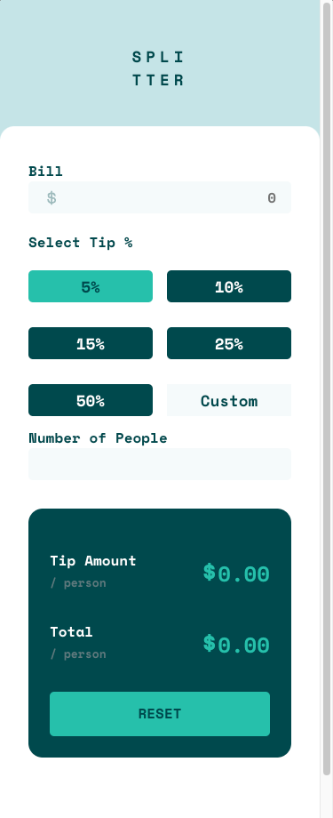
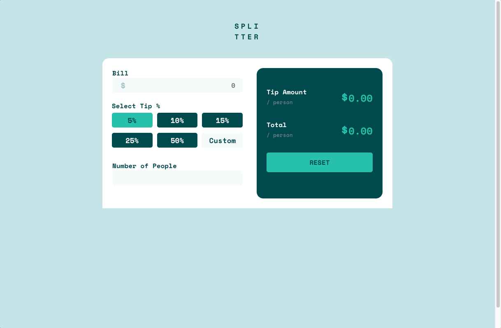

# Frontend Mentor - Tip calculator app solution

This is a solution to the [Tip calculator app challenge on Frontend Mentor](https://www.frontendmentor.io/challenges/tip-calculator-app-ugJNGbJUX).

## Table of contents

- [Overview](#overview)
  - [The challenge](#the-challenge)
  - [Screenshot](#screenshot)
  - [Links](#links)
- [My process](#my-process)
  - [Built with](#built-with)
  - [What I learned](#what-i-learned)
- [Author](#author)

## Overview

    Calculate tip

### The challenge

Users should be able to:

- View the optimal layout for the app depending on their device's screen size
- See hover states for all interactive elements on the page
- Calculate the correct tip and total cost of the bill per person

### Screenshot

### Links

## My process

## My process

- I configure the project architecture . 🏛️
- I clean the HTML of Comments and styles. 🧹
- I assign the HTML tags. 🎯
- I begin to measure the elements with figma to try to emulate the component as accurately as possible.📏
- I write the styles, I configure mediaquerys. 🕶️
- I create the logical part in JS. 🧠

### Built with

  

### What I learned

I learned the use of input at a deeper level, how to extract data from asynchronous processes, data validation, application of modifier classes.

## Author

- Website - [Git Repositories](https://github.com/cyeguez/tip-calculator-app-main)
- Frontend Mentor - [@Cyeguez](https://www.frontendmentor.io/profile/cyeguez)

